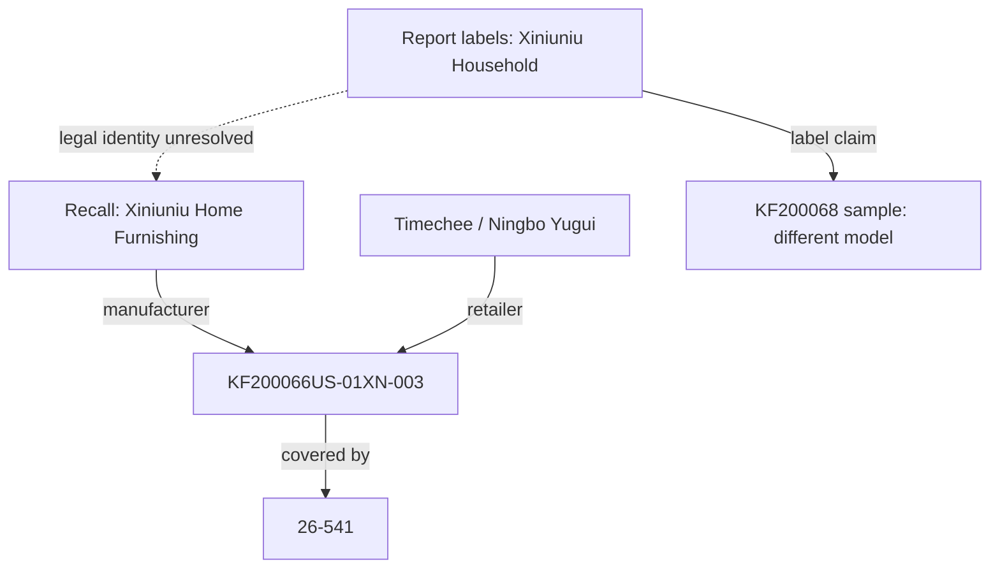
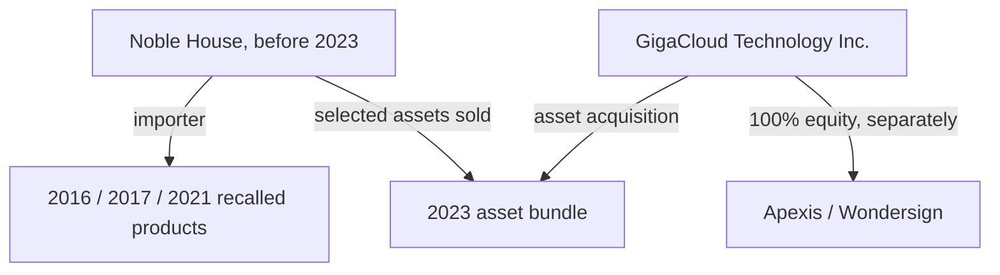

# DropShredder — manufacturer networks, identifiers and history

Research date: 2026-10-08. Bounded investigation completed and checkpointed incrementally on `research/20261008-defensive-intelligence`. Research input only: no production scores, runtime blacklists, extension permissions, builds or PR changes.

The accompanying graph contains 23 family investigations, 127 nodes (48 company nodes), 117 sourced directed edges, 39 source records, six cluster profiles, three neutral supplier leads, one tool assessment and two academic studies. Nodes also include products, events, storefronts and assets; node count is not a count of factories.

## What deserves investigation first

| Priority | Chain or issue | Reason and scope |
| --- | --- | --- |
| 1 | Hop Thang → Mainstays → Walmart → named liquidators | CPSC documents post-recall distribution. Track 26-522/26-726 as one lineage; manufacture country Vietnam. This establishes a specific resale failure, not a marketplace-wide defect rate. |
| 1 | Yita → five brand aliases; Merax beds → five brand names | Official multi-brand SKU/model tables offer strong fixtures for detecting relabeled recalled units. Factory unknown for Yita; Merax origin Vietnam. |
| 1 | Xiniuniu / Timechee versus OXYLIFE / FUFU&GAGA labels | Exact recalled model and a different tested sample are distinguishable. Legal-entity equivalence and conflicting label roles remain unresolved. |
| 2 | Jiangsu Liangjiang → Ningbo Tianqi → FUFU&GAGA bed | Exact model and documented assembly injuries; shared FUFU&GAGA name does not prove common ownership of other named companies. |
| 2 | Shenzhen toy-company chains and Petgravity seller | Direct product hazards and several exact package/batch identifiers. Missing factory identity must stay missing. |
| 3 | Noble House and Joybuy history | Multiple distinct historical product events justify deeper document review. Dated acquisitions/channel roles prevent attributing old events to the wrong current entity. |
| Historical only | Six FY2013 seized-shipment leads | Old port-inspection facts can seed identity searches, not current severe product verdicts. |

These are attention priorities, not calibrated failure probabilities or a ranking of the worst factories. The sample deliberately selected official adverse notices; no sales/exposure denominator, representative region comparison or current factory quality audit was obtained.

## Exact product chains

| ID | Entity chain / role | Product identifiers | Event | Scope limit |
| --- | --- | --- | --- | --- |
| N01 | Fujian Xiniuniu Home Furnishing Co., Ltd. (manufacturer); Ningbo Jiangbei Yugui E-commerce Co., Ltd., dba Timechee (retailer) | model-or-package: `KF200066US-01XN-003` | 26-541 (2026-06-11) | No plant street verified by recall. KF200066 is not KF200068; no prefix-wide match. |
| N02 | Label roles shown below | cover-model: `KF200068-01`; ASIN: `B0DPS9ZS3V`; item: `ROM200068-01-BABY`; tracking-label-model: `KF200068-02` | Sample report; no adverse event | Pass applies to sample only. Conflicting label roles/model suffixes are unresolved; this sample is not the Timechee recalled model. |
| N03 | Fujian Ming Jin Household Technology Limited (manufacturer); Areson Inc. (retailer) | model-or-package: `DC006-BK130-1-RR` | 25-292 (2025-05-22) | No unlisted Rolanstar units or other factory output in scope. |
| N04 | Wuxi Leclaire Home Products Co., Ltd. (manufacturer); Ningbo Jiangdong Peter International Trading Co. Ltd. (importer) | model-or-package: `HD016GRY` | 26-622 (2026-07-16) | HD016GRY is a sample carton SKU, not an exhaustive color/SKU list. Company city names are location leads, not factory geocodes. |
| N05 | Anji Guyou Furniture Co. Ltd. (retailer) | model-or-package: `Y-C51` | 25-293 (2025-05-22) | Factory is not named. Retailer role must not be promoted to manufacturer; oak color is not a solid-wood claim. |
| N06 | Shenzhen Aojieni Silicone Technology Co. LTD (manufacturer) | batch: `DS250238` | 26-635 (2026-07-23) | Identifier is batch, not model. One gagging incident reported, no injury. Similar pull-string toys do not establish shared factory. |
| N07 | Shenzhenshixingchuangyiyimaoyouxiangongsi (Shenzhen Xingchuangyi Trading Co. Ltd.) dba Chillife Official (importer) | model-or-package: `CHILLIFE01` | 26-727 (2026-08-27) | Factory unknown. Four choking incidents, no medical attention. Pinyin similarity or product similarity is not corporate identity. |
| N08 | Shenzhen Yuejia Mei Maoyi Youxian Gongsi (Shenzhen Yuejia Mei Trading Co. Ltd.) dba BUSOHA (importer) | Description or purchase-history match needed | 26-664 (2026-08-06) | No unique SKU obtained: text is product description, not a matchable unique identifier. Factory unknown. |
| N09 | Shenzhen Huakechuang Technology Co. Ltd., dba Huaker (retailer) | model-or-package: `20A-13` | 26-272 (2026-02-19) | No marks on toy pieces; identifier is on packaging. Factory unknown; no incidents reported. |
| N10 | Jiangsu Liangjiang Intelligent Furniture Co., Ltd. (manufacturer); Ningbo Tianqi Electronic Inc. (importer) | model-or-package: `KF210284US-01MH-A001` | 26-126 (2025-12-04) | Ningbo Tianqi and FUFU & GAGA TRADE CO., LTD are distinct unresolved entities, not proven common ownership. |
| N11 | Yita LLC (importer) | SKU: `FTBFSD-0161`; SKU: `FTBFSD-0162`; SKU: `FTBFSD-0212`; SKU: `FTBFSD-0246`; SKU: `FTBFSD-0465` | 26-251 (2026-02-05) | Association applies to listed recalled units; a multi-brand business or Chinese manufacture does not establish deceptive provenance or poor quality of unrelated goods. |
| N12 | GigaCloud Technology (USA) Inc. (importer) | model: `GX000392AAK`; model: `GX000391AAK`; model: `GX000383AAK` | 26-694 (2026-08-13) | Scope is the listed models/SKUs; do not expand it to every Merax/GigaCloud product or infer origin from brand similarity. This is research, not inspection of a current shopping listing. |
| N13 | Hop Thang Interior Wood Co. Ltd. (manufacturer); Walmart Inc. (retailer) | sample-lot-caption: `HCV202601` | 26-726 (2026-08-27); 26-522 (2026-05-28) | Description says manufacture September 2023–December 2025, while illustrative label caption shows January 2026/HCV202601. Preserve that source ambiguity and seek official model confirmation; do not invent a hard batch cutoff. |
| N14 | LYsolcusnee Guangzhoulinlikejiyouxiangongsi (Sanchio Store / LYsolcusnee) (seller) | Description or purchase-history match needed | 25-297 (2025-05-29) | Notice-time status may change; refresh before a user-facing alert. Do not misclassify a children's pretend pet-vet playset as a pet toy. This warning does not establish chemical toxicity, all-brand failure or pet injury. |

## Xiniuniu label trail: a useful unresolved link

Recall 26-541 identifies Fujian Xiniuniu Home Furnishing, Timechee and KF200066US-01XN-003. Supplier-profile locality/experience claims are leads; no official corporate registration was authenticated. [S01, S24]

Retailer-hosted report CN25OUGM001, issued 2025-04-08, reports Pass for a sample. Its cover lists KF200068-01; photographed labels include B0DPS9ZS3V, ROM200068-01-BABY and KF200068-02. Page 4 names Xiniuniu Household as manufacturer, OXYLIFE as distributor and FUFU&GAGA Trade as importer. Page 5 labels assign OXYLIFE importer and FUFU&GAGA manufacturer roles. Those are label claims, not proven corporate relationships. Home Furnishing/Household legal equivalence is unresolved. The tested sample is not the recalled Timechee model. Issuer authenticity and complete sample/report consistency remain unchecked. Three pages were rendered and visually read; hash and provenance are in S02. [S02]

Do not collapse similar English names, translate pinyin into invented Chinese registered names, infer legal identity from shared addresses, or expand recalls to all `KF` models. Preserve the original text and page locator. Certifying one sample cannot clear a whole factory; a different product recall cannot condemn the tested sample.

## Corporate and channel history

| Period | Source-backed observation | Consequence for attribution |
| --- | --- | --- |
| 2016 | Noble House counter stools 16-175: sharp kick plates, six injury reports, China/Vietnam origin. | Historical importer event; plant not verified here. |
| 2017 | Noble House chairs 17-177: breaking legs, six reports/four bruise incidents, Malaysia origin. | Distinct product event, not Chinese origin. |
| 2021 | Noble House units 21-718: four HM models; Vietnam; no injuries reported. | Match exact HM model/description. Source UPC anomalies are not silently corrected. |
| October/November 2023 | GigaCloud reports acquisition of selected Noble House assets; Nov 1 announcement approximately $85m subject to adjustments, later results $77.6m. | Asset transfer differs from entire-company equity ownership. Do not retroactively attribute pre-acquisition events or liability. |
| November 2023 | GigaCloud reports 100% Apexis/Wondersign equity acquisition, $10m. | Catalog-kiosk/SaaS context; not a product-quality signal. |
| December 2023 / June 2024 | Joybuy channel appears in Relax magnetic-ball 24-071 and sling-carrier 24-258 recalls. | Two distinct historical events, factories unknown; no automatic all-Joybuy warning. |
| May/August 2026 | Mainstays original recall/reannouncement, with named liquidators. | One event lineage; preserve distribution history and current remedy. |

Joybuy's carrier notice supplies eight current-at-notice seller names, several former names, storefronts and purchase-history guidance. The graph preserves that table as seller/channel associations. Retailer-supplied evidence or a shared channel does not prove common ownership or manufacture. Former-name claims need registry dates before current identity merges. [S21–S22]

## Manufacturing geography and history

| Cluster | Documented history or role | Identifier use | Evidence limit |
| --- | --- | --- | --- |
| Chenghai, Shantou, Guangdong | City report describes a large toy cluster, including 68,000 production/business entities and AI-toy ecosystem agreements. | Catalogue/exhibitor leads; connected-toy app/privacy checks. Figures are promotional reported claims, not safety rates. | S25; no cluster-wide adverse rate established |
| Anji, Zhejiang | Report dates chair development to 1981 and describes later moves from simple parts/OEM toward R&D-led seating. | Chair-part and final-assembly roles matter. Regional history does not establish any specific company's current compliance. | S26; no cluster-wide adverse rate established |
| Nankang, Ganzhou, Jiangxi | Guide dates furniture cluster to early 1990s and lists wood distribution, shared preparation/spraying and sales-logistics infrastructure. | A sourcing city or shared processing centre is not a single factory. Material purchase, machining, coating and assembly may be separate. | S27; no cluster-wide adverse rate established |
| Keqiao, Shaoxing, Zhejiang | China Textile City founded 1988, renamed 1992; report describes procurement trade and cross-border e-commerce. | Fabric merchant versus weaving/dyeing/garment factory must be separated; market address cannot establish garment origin. | S28; no cluster-wide adverse rate established |
| Shuitou, Pingyang, Wenzhou, Zhejiang | Public investment profile describes a pet-product manufacturing project in Shuitou. | Proposed project is not proof a plant is operating, nor a pet-product quality assessment. | S29; no cluster-wide adverse rate established |
| Longjiang, Shunde, Foshan, Guangdong | Furniture association describes design/manufacturing/materials cluster and August 2025 furniture/material exhibitions. | Exhibitor/material supplier leads; finished goods, upholstery, hardware and showroom roles need distinct entity records. | S39; no cluster-wide adverse rate established |

Factory locations from photographed labels, corporate office locations, trading-company addresses, manufacturing-country declarations, retail warehouses and export ports must occupy distinct fields. The graph supplies no invented coordinates. Neutral Anji supplier self-descriptions are catalogued for follow-up, without adverse flags. An association or municipal promotion can document its own cluster claim; it cannot independently certify every exporter.

## Historic export-chain leads

The CPSC release is dated 2013-12-02 despite its `/2014/` URL. Six selected rows connect foreign-manufacturer fields to importers and exact model strings: Alliance/Caribbean Retail Ventures, Ankyo/Dollar Tree, Kedeshun/Neway, source-spelled Shaintou Chenghai Tomade/Allied Star, Hang Wing/Angelica's Record Distributors and Shantou Ming Hong/Asonic. They concern FY2013 seized shipments with listed violations. No current identities or recurrence were established. Preserve source spelling and table-row boundaries; source name/role is not a registry-authenticated entity. [S23]

## Tools and academic transfer

Open Supply Hub provides contributor-attributed facility records and OS IDs. Public search/download and paid token-based API access are distinct. Current advertised API pricing, billing distinctions and limits are retained in T01; no account, request or submission was made. Suitable next step for the free core is an explicit public research link or licensed static reference subset, subject to terms verification—not an assumed unlimited free API. A supplier contribution must remain a claim with its contributor/date; an OS ID is not a SKU's provenance certificate. [S33–S35]

The 2024 supply-chain KG preprint evaluates extraction on EV/Wikipedia sentences, not empirical supplier truth, and does not measure missed-triple recall. Its supplier-link accuracy is weaker than entity recognition. The useful transfer is typed candidate extraction with preserved source locators; documentary verification still gates merges and verdicts. A later 2025 publisher record was found, but full journal text could not be opened. It is not counted as an independent replication. [S36, S38]

The second 2024 study describes a North-American manufacturer-discovery graph and a public dataset. Only its abstract/metadata were reviewed; code/data/license and applicability to Chinese consumer goods remain unchecked. It is a retrieval/ontology lead, not validation of DropShredder accuracy. [S37]

## Identifier handoff for engineering

| Input | Store | Permitted research use | Must not infer |
| --- | --- | --- | --- |
| Exact model, SKU, batch, ASIN | Raw value, normalized search value, source/page, identity type, product description and dates | Candidate retrieval and scoped product matching | Prefix-wide recall scope; ASIN resolves factory |
| Company or storefront name | Original spelling, role, jurisdiction, notice-time date, aliases and alias source | Entity-resolution candidate | Manufacturer role from seller name; legal equivalence from pinyin similarity |
| Factory/office/warehouse address | Address role and confidence; facility/company distinct | Location lead and documentary cross-check | Country of manufacture from dispatch warehouse |
| Test/certificate report | Issuer, report ID, sample model, dates, result, scope, authenticity status | Claim verification and contradictory scope review | All-company safety; logo-only compliance |
| Recall/warning | Agency, ID, status, hazard, scope, remedy refresh date, lineage | Product-safety fact once item scope is verified | Deception; all-brand failure; historical notice means current business unchanged |
| Manufacturing region | Source-specific origin declaration and unknown status | Disclosed provenance; future category-controlled hypothesis evaluation | Validated poor-quality coefficient without representative denominator |

Data flow should be candidate retrieval → product identity check → notice scope check → current-status refresh → evidence-bearing product-safety display. Deception conclusions retain the repository's independent-evidence gate. Recalls do not automatically prove dropshipping or deceptive resale.

Evaluation fixtures worth building in engineering: exact recalled model positive; one-character/suffix near miss; same brand different model; shared manufacturer but non-recalled sample; importer mistaken for factory; mirrored notice counted twice; superseding notice counted twice; former-name effective-date mismatch; report role conflict; recall image caption versus textual date conflict; seller-only notice with unknown factory. These fixtures are proposals, not executed tests.

## Boundaries and next gaps

No registry authentication, beneficial ownership audit, factory visit, material testing, live Amazon/Walmart product scan, paid API integration, browser QA or recall remedy test occurred. Archive records preserve source presence and notes; they are not complete forensic web captures. Safety Korea's Petgravity search result illustrates a role-translation discrepancy by calling the original seller a manufacturer; the originating notice governs the graph role.

The next owner-requested batch will cover popular category gaps: battery/charger products, cosmetics, small appliances, fitness gear, lighting and jewelry. The map remains available to other workers as a versioned research input.

## Source presence register

| ID | Kind / depth | Primary source |
| --- | --- | --- |
| S01 | regulator; opened | [Source](https://www.cpsc.gov/Recalls/2026/Timechee-Changing-Table-Dressers-Recalled-Due-to-Risk-of-Serious-Injury-or-Death-from-Tip-Over-and-Entrapment-Hazards-Violate-Mandatory-Standard-for-Clothing-Storage-Units-Sold-on-Amazon-by-Timechee) |
| S02 | retailer-hosted-test-report; downloaded; pages 1,4,5 rendered and visually read; selected text examined | [Source](https://images.thdstatic.com/catalog/pdfImages/13/13171b70-dcca-4c5c-9652-f602175a1de9.pdf) |
| S03 | regulator; opened | [Source](https://www.cpsc.gov/Recalls/2025/Areson-Recalls-Rolanstar-6-Drawer-Dressers-Due-to-Risk-of-Serious-Injury-or-Death-from-Tip-Over-and-Entrapment-Hazards) |
| S04 | regulator; primary search excerpt; direct open failed | [Source](https://www.cpsc.gov/Recalls/2026/Wade-Logan-Annyka-9-Drawer-Fabric-Dressers-Recalled-Due-to-Risk-of-Serious-Injury-or-Death-from-Tip-Over-and-Entrapment-Hazards-Violate-Mandatory-Standard-for-Clothing-Storage-Units-Imported-by-Ningbo-Jiangdong-Peter-International-Trading) |
| S05 | regulator; opened | [Source](https://www.cpsc.gov/Recalls/2025/Sivan-Dressers-Recalled-Due-to-Risk-of-Serious-Injury-or-Death-from-Tip-Over-and-Entrapment-Hazards) |
| S06 | regulator; opened | [Source](https://www.cpsc.gov/Recalls/2026/Aojieni-Silicone-Recalls-Sili-Factory-Pull-String-Teething-Toys-Due-to-Risk-of-Serious-Injury-or-Death-from-Choking-Violate-Mandatory-Standard-for-Toys) |
| S07 | regulator; opened | [Source](https://www.cpsc.gov/Recalls/2026/Montessori-Baby-Toy-Sets-Recalled-Due-to-Risk-of-Serious-Injury-or-Death-from-Choking-Violate-Mandatory-Standard-for-Toys-Sold-on-Amazon-by-Chillife-Official) |
| S08 | regulator; opened | [Source](https://www.cpsc.gov/Recalls/2026/Magnetic-Fidget-Sliders-Recalled-Due-to-Risk-of-Serious-Injury-or-Death-from-Magnet-Ingestion-Violate-Mandatory-Standard-for-Toys-Sold-on-Amazon-by-BUSOHA) |
| S09 | regulator; opened | [Source](https://www.cpsc.gov/Recalls/2026/Huaker-Magnetic-Balls-and-Rods-Sets-Recalled-Due-to-Risk-of-Serious-Injury-or-Death-from-Choking-Violates-the-Small-Ball-Ban) |
| S10 | regulator; primary search excerpt; direct open 403 | [Source](https://www.cpsc.gov/Recalls/2026/Ningbo-Tianqi-Electronic-Recalls-FUFUGAGA-Murphy-Wall-Beds-Due-to-Impact-and-Laceration-Hazards) |
| S11 | regulator; opened | [Source](https://www.cpsc.gov/Recalls/2026/YITA-Recalls-Multiple-Brands-of-Dressers-Due-to-Risk-of-Serious-Injury-or-Death-from-Tip-Over-and-Entrapment-Hazards-Violates-Mandatory-Standard-for-Clothing-Storage-Units) |
| S12 | regulator; opened | [Source](https://www.cpsc.gov/Recalls/2026/GigaCloud-Technology-USA-Recalls-Merax-Murphy-Beds-Due-to-Risk-of-Serious-Injury-or-Death-from-Impact-and-Crush-Hazards) |
| S13 | regulator; opened | [Source](https://www.cpsc.gov/Recalls/2026/Walmart-Reannounces-Recall-of-Mainstays-Nine-Drawer-Fabric-Dressers-Due-to-Risk-of-Serious-Injury-or-Death-from-Tip-Over-and-Entrapment-Hazards-Walmart-Distributed-Recalled-Dressers-Post-Recall-Sold-to-Consumers-Through-Liquidators) |
| S14 | regulator; primary CPSC search excerpt; direct open 403 | [Source](https://www.cpsc.gov/Recalls/2025/CPSC-Warns-Consumers-to-Immediately-Stop-Using-Petgravity-Cat-Toys-Due-to-Risk-of-Serious-Injury-or-Death-to-Children-from-Ingestion-Hazard-Violations-of-Federal-Regulations-for-Consumer-Products-with-Coin-Batteries-Sold-on-Amazon-by-Sanchio-Store) |
| S15 | regulator; primary search excerpt | [Source](https://www.cpsc.gov/Recalls/2026/Walmart-Recalls-Mainstays-9-Drawer-Fabric-Dressers-Due-to-Risk-of-Serious-Injury-or-Death-from-Tip-Over-and-Entrapment-Hazards-Violates-Mandatory-Standard-for-Clothing-Storage-Units) |
| S16 | company-announcement; opened | [Source](https://investors.gigacloudtech.com/news-releases/news-release-details/gigacloud-technology-inc-completes-acquisition-noble-house) |
| S17 | company-financial-results; primary search excerpt | [Source](https://investors.gigacloudtech.com/news-releases/news-release-details/gigacloud-technology-inc-announces-fourth-quarter-2023-and-year) |
| S18 | regulator; primary search excerpt; direct open failed | [Source](https://www.cpsc.gov/Recalls/2016/noble-house-recalls-counter-stools) |
| S19 | regulator; opened | [Source](https://www.cpsc.gov/Recalls/2017/noble-house-recalls-chairs) |
| S20 | regulator; opened; model table read | [Source](https://www.cpsc.gov/Recalls/2021/Noble-House-Home-Furnishings-Recalls-Chests-Cabinets-and-Dressers-Due-to-Tip-Over-and-Entrapment-Hazards-Recall-Alert) |
| S21 | regulator; primary search excerpt; direct open 403 | [Source](https://www.cpsc.gov/Recalls/2024/Sling-Carriers-Recalled-Due-to-Infant-Suffocation-and-Fall-Hazards-Violation-of-the-Federal-Safety-Regulation-for-Sling-Carriers-Sold-on-Walmart-com-through-Joybuy-Marketplace-Express) |
| S22 | regulator; primary search excerpt | [Source](https://www.cpsc.gov/Recalls/2024/High-Powered-Magnetic-Balls-Recalled-Due-to-Ingestion-Hazard-Sold-Exclusively-on-Walmart-com-through-Joybuy?language=en) |
| S23 | regulator; opened | [Source](https://www.cpsc.gov/Newsroom/News-Releases/2014/CPSC-Uses-Pilot-Risk-Assessment-Tool-to-Strengthen-Import-Safety) |
| S24 | supplier-hosted-directory-profile; opened | [Source](https://fzdeyu.en.made-in-china.com/) |
| S25 | municipal-hosted-industry-report; opened | [Source](https://english.shantou.gov.cn/english/news/content/post_2542464.html) |
| S26 | government-hosted-newspaper-report; opened | [Source](https://zjic.zj.gov.cn/ywdh/qyfz/202607/t20260730_24171873.shtml) |
| S27 | municipal-investment-guide; opened | [Source](https://www.nkjx.gov.cn/nkqxxgk/c116315/202305/8c8a1aaef01144eebf9563746d1e1445.shtml) |
| S28 | municipal-information-office-report; opened | [Source](https://www.ezhejiang.gov.cn/shaoxing/2025-04/03/c_1084790.htm) |
| S29 | government-investment-project-profile; primary search excerpt; PDF not downloaded/read | [Source](https://zjjcmspublic.oss-cn-hangzhou-zwynet-d01-a.internet.cloud.zj.gov.cn/jcms_files/jcms1/web1937/site/attach/0/3e02fc05e54841fa9aa0ee7a72e7578b.pdf) |
| S30 | supplier-self-description; primary supplier search excerpt | [Source](https://www.zjjinbiao.com/) |
| S31 | supplier-self-description; primary supplier search excerpt | [Source](https://www.zj-demure.com/) |
| S32 | supplier-self-description; primary supplier search excerpt | [Source](https://baizhijia.net/about/) |
| S33 | tool-provider; opened | [Source](https://info.opensupplyhub.org/api) |
| S34 | official-tool-documentation; opened | [Source](https://info.opensupplyhub.org/resources/api-documentation) |
| S35 | official-tool-documentation; primary search excerpt | [Source](https://info.opensupplyhub.org/resources/how-to-search) |
| S36 | academic-preprint; abstract, methods and evaluation sections read | [Source](https://arxiv.org/html/2408.07705v1) |
| S37 | academic-preprint; abstract and metadata read; full paper/data not evaluated | [Source](https://arxiv.org/abs/2404.06571) |
| S38 | academic-publisher; primary publisher search excerpt; direct open failed | [Source](https://www.tandfonline.com/doi/full/10.1080/00207543.2025.2575841) |
| S39 | industry-association-event-report; primary association search excerpt | [Source](https://www.cnfa.com.cn/infodetails4477.html) |
